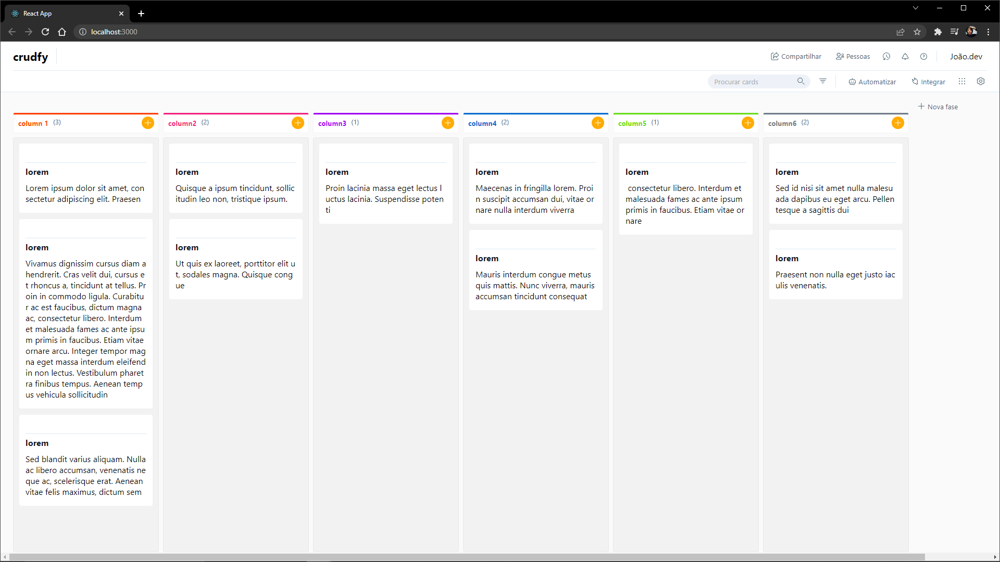
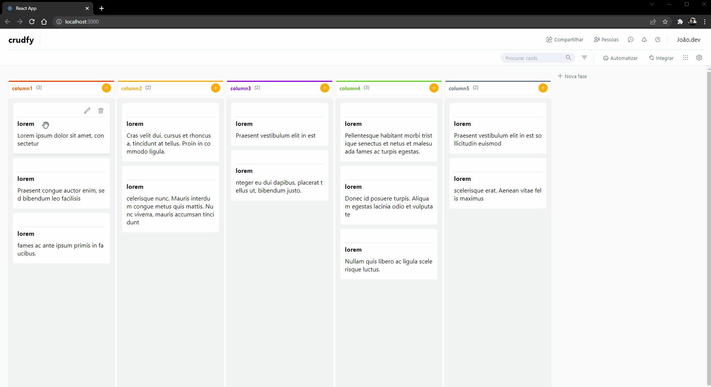
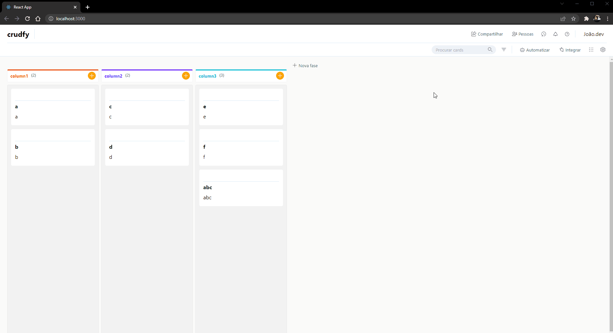
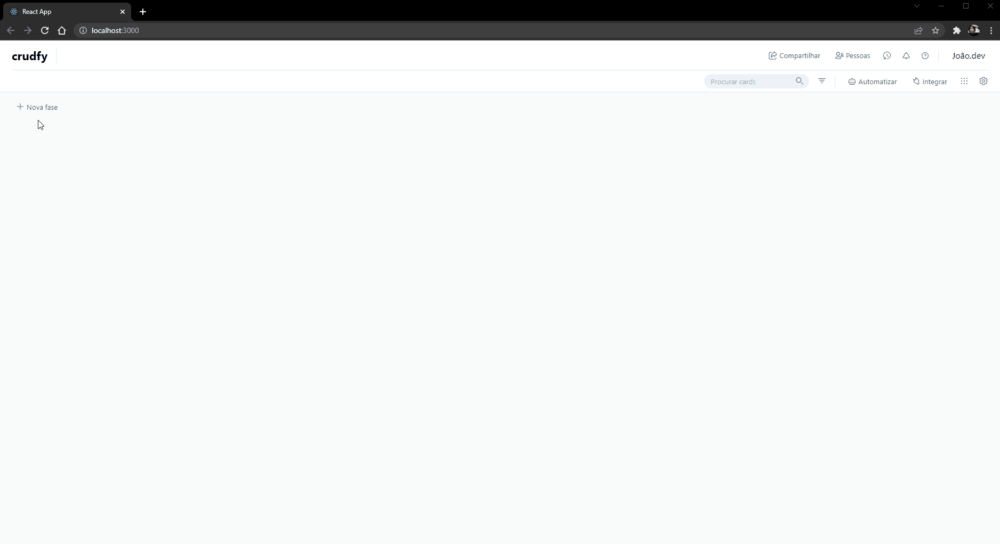

<h1 style="text-align: center;"> Tesla clone </h1>

Recration of official tesla website 

    <a href="#about">About</a> ∙
    <a href="#built-with">Built With</a> ∙
    <a href="#features">Features</a> ∙

<h1>About</h1>

Simple project recreating Pipefy features.

<h1>Built With</h1>

- React JS;
- CSS;

<h2>These are some concepts that I covered in the building process:</h2>

- React Hooks;
- State Management;
- Context API;
- Object and arrays manipulation;
- Responsive Layout, pseudo-classes and pseudo-elements in CSS;
- Trying to Best Practices and Refactoring.

<h1>Features</h1>

<h2>Drag and Drop</h2>
Simple drag and drop system.

<h2>Search</h2>
Search bar for the columns.

<h2>Crud</h2>
Columns and Cards fully editable,

